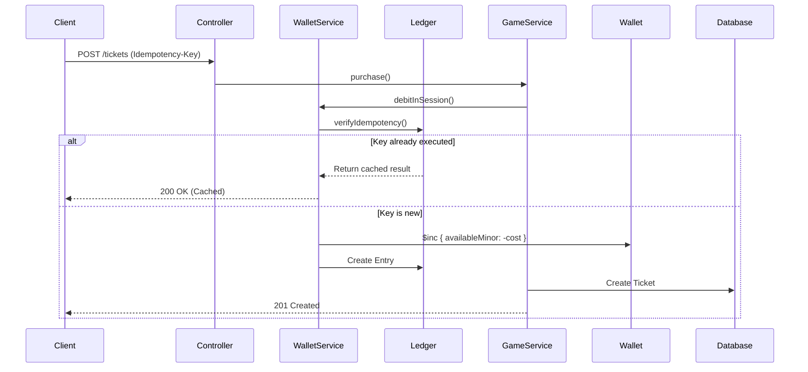

# Core Architecture

The iGames Framework is engineered around a highly scalable, event-driven architecture designed to withstand the concurrency requirements of live multiplayer betting.

## System Design

1. **NestJS API Gateway**: Exposes secure HTTP endpoints and manages user lifecycle.
2. **Socket.io Game Gateway**: Powers real-time state synchronization using `@nestjs/websockets`.
3. **Mongoose Wallet Engine**: Atomic mutations strictly enforce double-spend protection.
4. **Redis Distributed Engine**: Orchestrates `@Cron` jobs across multiple instances.

## Request Flow: Purchasing a Ticket

When a user purchases a ticket, the framework guarantees transactional integrity:

## State Management (Game Schedulers)

We rely on **Redis Distributed Locks** inside NestJS `@Cron` workers to ensure background games execute precisely once, even when 10+ backend containers are running simultaneously.

- **KenoScheduler**: Runs every 1 minute. Acquires a lock (`keno:draw:lock`), creates a pending draw, executes RNG via `HMAC-DRBG`, and delegates to `WalletService` for massive parallel settlements.
- **BingoScheduler**: Runs every 5 seconds. Pulls active rooms, issues unique ball draws, and evaluates the matrix against the rule engine.

## Graceful Shutdowns

The framework hooks into NestJS `OnApplicationShutdown`. On termination:
1. `system.maintenance` is emitted to all WebSockets to alert frontends.
2. Schedulers flip their `shuttingDown` booleans, preventing new operations.
3. Active `ClientSession` transactions finish committing to MongoDB.
